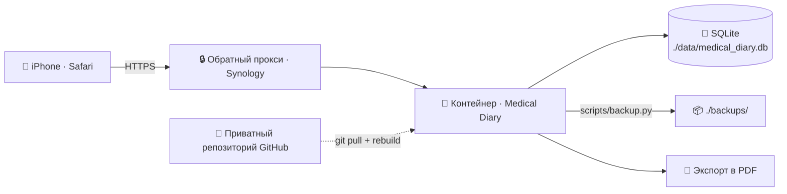

<div align="center">


<div align="center">

[](#-архитектура)
[](#-архитектура)
[](#-архитектура)
[](#-безопасность)
[](#-скриншоты)
[](#-лицензия-и-дисклеймер)

</div>

> [!IMPORTANT]
> 🩺 **Medical Diary** — инструмент для *фиксации* наблюдений, а не для медицинских решений.
> Сервис **не ставит диагнозы и не назначает лечение**. Автоматические оценки и оценки ИИ являются **справочными**.

---

## 📖 О проекте

**Medical Diary v2** — приватный веб-дневник для личного наблюдения за показателями здоровья, спроектированный для быстрого ввода с iPhone в Safari. Несколько раз в день вы за пару касаний фиксируете:

| Показатель | Что записывается |
| :---: | :--- |
| 🩸 **Глюкоза крови** | натощак и после еды |
| ❤️ **Давление и пульс** | систолическое / диастолическое + пульс |
| 🍽 **Питание** | съеденные продукты с точным количеством |

Каждая запись автоматически сохраняется в базу данных **с датой и точным временем**.

### ✨ Возможности

- ⚡ **Быстрый ввод одной рукой** — крупные элементы, минимум действий
- 📱 **Mobile-first интерфейс** — адаптация под iPhone и Safari
- 🔐 **Вход по Face ID / Touch ID** через WebAuthn
- 🗂 **История** с фильтрами по датам и типам записей + наглядная общая таблица
- 🚦 **Справочная подсветка** значений относительно персональных диапазонов
- 📈 **Графики** динамики глюкозы и давления
- 📄 **Экспорт периода в PDF** — таблица, удобная для печати и отправки врачу
- 🧽 **Мягкое удаление** записей — данные не теряются безвозвратно
- 🧾 **Аудит** всех действий
- 🛡 **Защита от перебора паролей**
- 💾 **Резервное копирование SQLite**
- 🐳 **Запуск в Docker на Synology NAS**

---

## 📸 Скриншоты


| ✍️ Быстрый ввод | 🗂 История и фильтры | 📈 Графики и PDF |
| :---: | :---: | :---: |
|  |  |  |

---

## 🏗 Архитектура



- 🐳 один Docker-контейнер приложения;
- 💾 база данных **SQLite** внутри контейнера, файл хранится в `./data/medical_diary.db` (постоянный volume);
- 📦 резервные копии — в `./backups/`;
- 🏠 деплой на Synology — `/volume1/docker/medical_diary`;
- 🔏 закрытый GitHub-репозиторий `medical_diary`.

---

## 🚀 Установка на Synology

### 0️⃣ Требования

- Synology NAS с поддержкой Docker (пакет **Container Manager** / Docker);
- DSM 7.x, включённый SSH (**Панель управления → Терминал и SNMP**);
- приватный репозиторий `medical_diary` и доступ к нему (токен или SSH-ключ).

### 1️⃣ Подключитесь и создайте каталог

```bash
ssh пользователь@IP_СИНОЛОДЖИ
sudo mkdir -p /volume1/docker/medical_diary
cd /volume1/docker/medical_diary
```

### 2️⃣ Скачайте код

```bash
sudo git clone https://github.com/ВАШ_ПОЛЬЗОВАТЕЛЬ/medical_diary.git .
```

### 3️⃣ Настройте окружение

```bash
cp .env.example .env
nano .env
```

Сгенерируйте секретный ключ:

```bash
openssl rand -hex 32
```

Задайте в `.env` как минимум `SECRET_KEY`, `ADMIN_USERNAME` и `ADMIN_PASSWORD`.

> [!WARNING]
> 🔑 `ADMIN_PASSWORD` применяется **только один раз** — при первой инициализации пустой БД.
> На уже работающей установке правка `.env` пароль **не меняет**.

### 4️⃣ Запустите

```bash
docker compose up -d --build
```

Проверка:

```bash
curl http://127.0.0.1:8000/health
```

### 5️⃣ Включите HTTPS (обязательно для Face ID / Touch ID)

WebAuthn работает только по HTTPS. Создайте обратный прокси:
**Панель управления → Портал входа → Дополнительно → Обратный прокси**
(источник: `https://diary.ваш-домен`, назначение: `http://localhost:8000`), затем допишите в `.env`:

```env
SESSION_COOKIE_SECURE=true
WA_RP_ID=diary.ваш-домен
WA_ORIGIN=https://diary.ваш-домен
```

и примените: `docker compose up -d`.

### 6️⃣ Первый вход

1. Откройте сервис по HTTPS-адресу и войдите с `ADMIN_USERNAME` / `ADMIN_PASSWORD`.
2. Смените пароль в панели администратора.
3. Зарегистрируйте Face ID / Touch ID (WebAuthn) для входа в одно касание.

### 7️⃣ Настройте автобэкапы (рекомендуется)

**Плановщик задач** → Создать → По расписанию → пользовательский скрипт (ежедневно, например в 03:00):

```bash
docker exec medical-diary python3 scripts/backup.py
```

Дополнительно копируйте `./backups/` за пределы NAS в зашифрованном виде.

---

## ⚙️ Переменные окружения

| Переменная            | Назначение                          |
| --------------------- | ----------------------------------- |
| `DATABASE_PATH`       | Путь к SQLite внутри контейнера     |
| `SECRET_KEY`          | Секретный ключ сессий (обязательно) |
| `SESSION_COOKIE_SECURE` | Требовать HTTPS для cookie        |
| `ADMIN_USERNAME`      | Логин первого администратора        |
| `ADMIN_PASSWORD`      | Пароль первого администратора       |
| `WA_RP_ID`            | Домен для WebAuthn                  |
| `WA_ORIGIN`           | HTTPS-origin для WebAuthn           |
| `FONT_PATH`           | Путь к шрифту для кириллицы в PDF   |

---

## 🧰 Шпаргалка владельца

| Задача | Команда |
| :--- | :--- |
| ✅ Проверка здоровья сервиса | `curl http://127.0.0.1:8000/health` |
| ▶️ Запуск / пересборка | `docker compose up -d --build` |
| 🛑 Остановка | `docker compose down` |
| 🪵 Логи | `docker logs -f medical-diary` |
| 💾 Резервная копия | `docker exec medical-diary python3 scripts/backup.py` |
| 🔑 Сброс пароля админа | `./scripts/reset_admin_password.sh --ask` |
| 🔄 Обновление | `git pull && docker compose up -d --build` |

---

## 🔐 Безопасность

-  `.env` **не коммитится**; секреты хранятся только в `.env`;
- 🗄 данные и бэкапы **не публикуются в Git**;
- 🔏 используйте **приватный репозиторий**;
- 🔒 рекомендуется закрыть сервис **обратным прокси с HTTPS** (+ `SESSION_COOKIE_SECURE=true`);
- 🛡 защита от перебора паролей и **аудит всех действий**;
- 🧾 храните `.env` и базу данных в надёжном месте;
- 💾 регулярно делайте **зашифрованные бэкапы**;
- 🚫 не публикуйте медицинские данные.

---

## 🔑 Восстановление доступа администратора

- `ADMIN_PASSWORD` в `.env` применяется только один раз, при первой инициализации пустой БД;
- сменить пароль, будучи залогиненным, можно в **панели администратора**;
- если доступ потерян:

  ```bash
  ./scripts/reset_admin_password.sh --ask
  ```

  контейнер останавливать не нужно; либо:

  ```bash
  docker exec --env-file .env medical-diary python3 scripts/reset_admin_password.py
  ```

  подробности и флаги — `reset_admin_password.py --help`.

---

## 💾 Резервное копирование и восстановление

```bash
docker exec medical-diary python3 scripts/backup.py
```

Копии складываются в `./backups/` (постоянный volume). Для восстановления остановите контейнер, замените `./data/medical_diary.db` файлом из копии и запустите контейнер снова.

---

## 🆕 Что нового во v2

| Было (v1) | Стало (v2) |
| :--- | :--- |
| Вход по паролю | ➕ WebAuthn: Face ID / Touch ID |
| Таблица и история | ➕ графики динамики глюкозы и давления |
| Ручная оценка значений | ➕ справочная подсветка персональных диапазонов |
| Обычное удаление | ➕ мягкое удаление + аудит всех действий |
| Базовая защита | ➕ защита от перебора паролей |

---

## ⚠️ Лицензия и дисклеймер

> Сервис хранит данные пользователя и **не ставит диагнозы**.
> Медицинские данные вводятся пользователем **вручную**.
> Приложение не назначает лечение; автоматические оценки — справочные.

**Лицензия:** приватный проект для личного использования.

---

<div align="center">


Сделано с ❤️ и 🐳 для личного использования на Synology

</div>